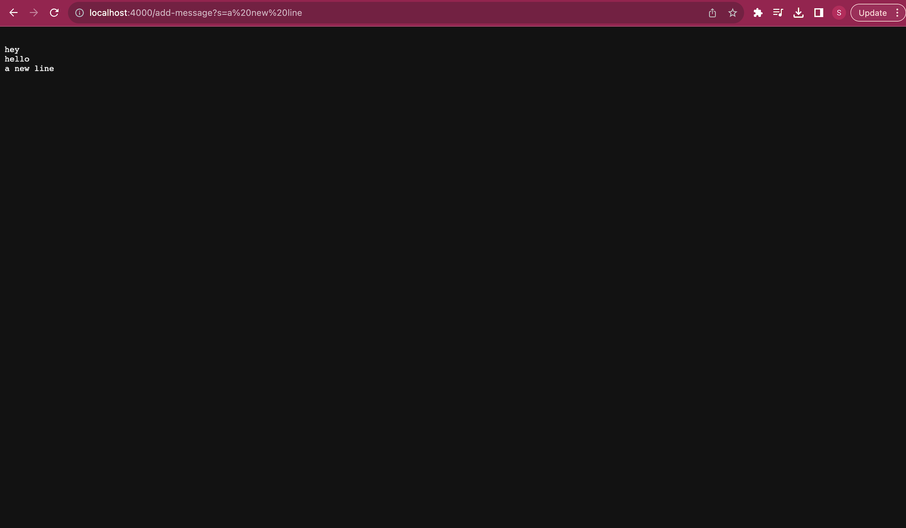
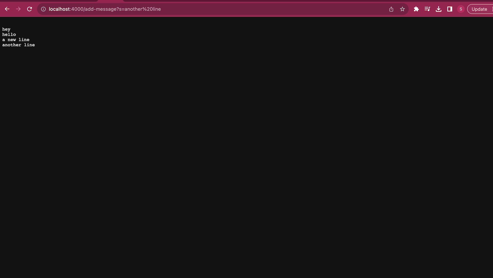

PART 1

1. The method handleRequest is being used here.
2. The argument being input is "a new line"
3. The value of the variable ans got changed which stores the string va;ues to be displayed

1. The method handleRequest is being used here.
2. The argument being input is "another line"
3. The value of the variable ans got changed which stores the string va;ues to be displayed

PART 2

PART 3 
I learnt how to create servers in lab 3 which was really cool since I can now make various different types of servers that can do different things. I have also become much more familiar with github.
