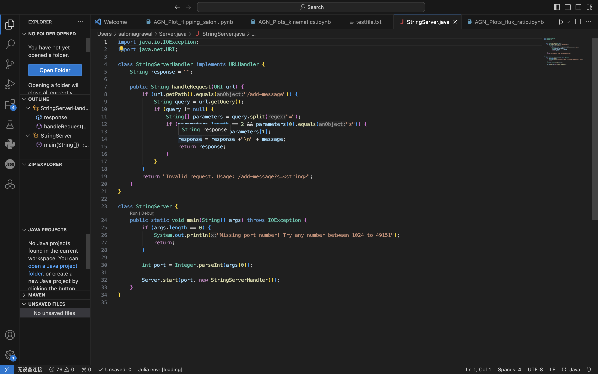

PART 1

1. The method handleRequest is being used here.
2. The argument being input is the URL of the server
   An important field is query which gets the Query from the URL
4. The value of the variable ans got changed from "hey/n hello" to "hey/n hello/n a new line".

1. The method handleRequest is being used here.
2. The argument being input is the URL of the server
4. The value of the variable ans got changed from "hey/n hello/n a new line" to "hey/n hello/n a new line/n another line".

PART 2

I was unable to log in without a password at home because it kept showing that the password I was typing was wrong even though I have been using it to log in for the past 3 weeks. However, I was able to do this during lab and got logged in without havign to type in a password.
I was asked to go to the office hours in the feedback but I plan on doing that this week as I had 3 midterms last week and was really busy preparing for them.

PART 3 
I learnt how to create servers in lab 3 which was really cool since I can now make various different types of servers that can do different things. I have also become much more familiar with github.
